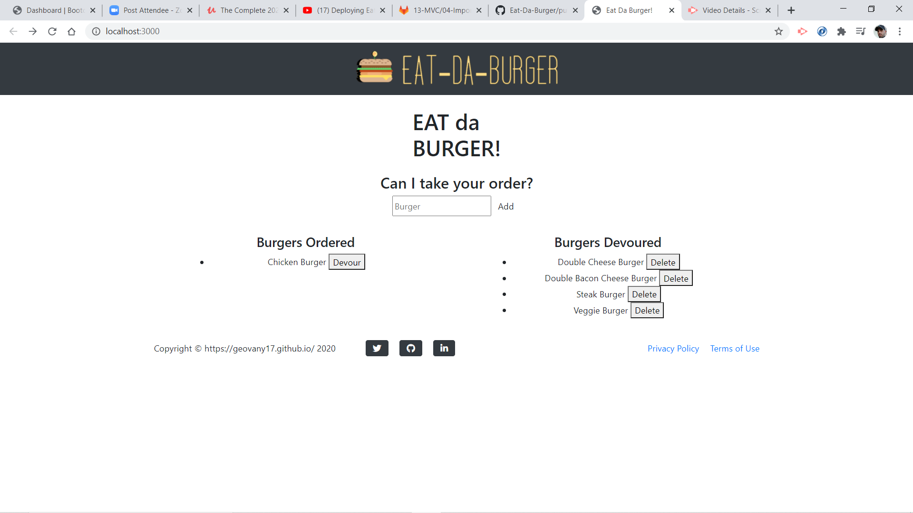

#  Eat-Da-Burger! 

## Description

Eat-Da-Burger!! is a restaurant app that lets users input the names of burgers they'd like to eat. When the user submits a burger's name, the app displays the burger on the left side of the page -- waiting to be devoured. Each burger in the **Available Burgers** waiting area has a `DEVOUR IT` button. When the user clicks it, the burger moves to the right side of the page, under **Burgers Devoured**.

## Table of contents

- [Description](#Description)
- [Installation](#Installation)
- [Usage](#Usage)
- [Licence](#Licence)
- [Contributors](#Contributors)
- [Test](#Test)
- [Repository Link](#Repository)
- [GitHub Info](#GitHub)

## Demo

Eat-Da-Burger is hosted on Heroku. Check it out by [clicking here](https://github.com/Geovany17/Eat_Da_Burger/deployments/activity_log?environment=obscure-headland-33923).

## Getting Started

To use Eat-Da-Burger locally, use http://localhost:3000 after completing the following steps:

## Technologies Used

- MySQL
- Node.js
- Express
- Handlebars

## Licence

## Contributors

Geovany17

## Test

## Repository

- [Project Repo](https://github.com/Geovany17/Eat_Da_Burger)
- [Deployed Repo]()

## GitHub

- Geovany Cardoza
- [GitHub Profile](https://github.com/Geovany17)
